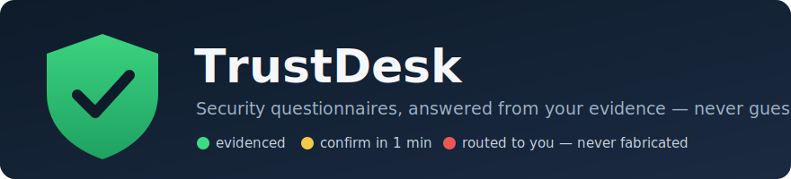
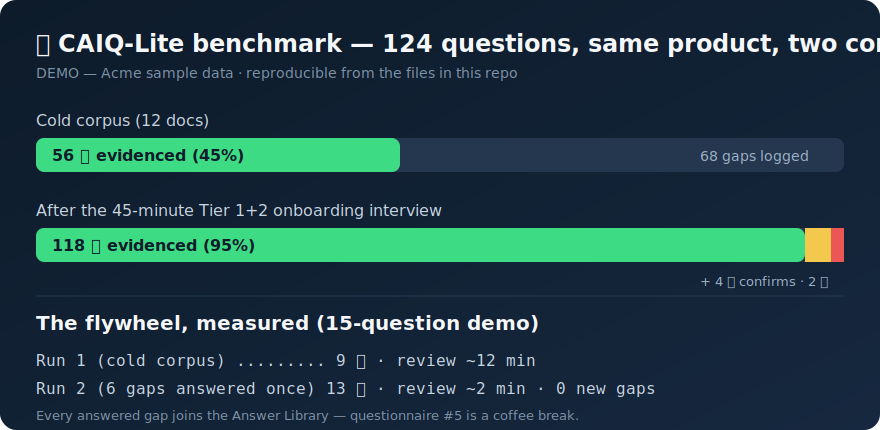
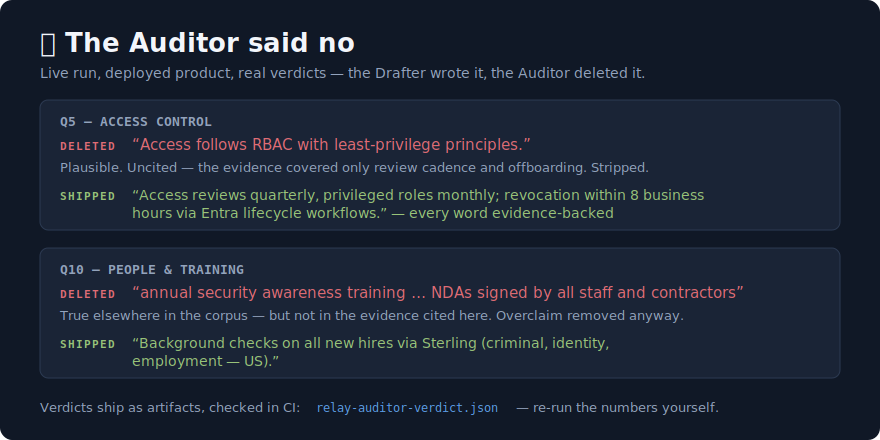
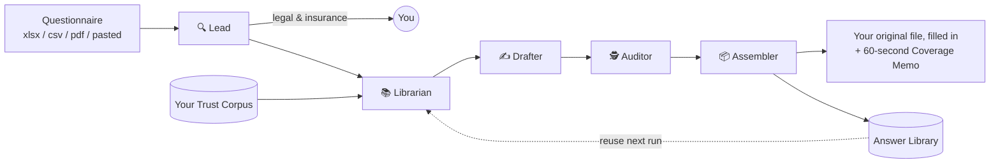
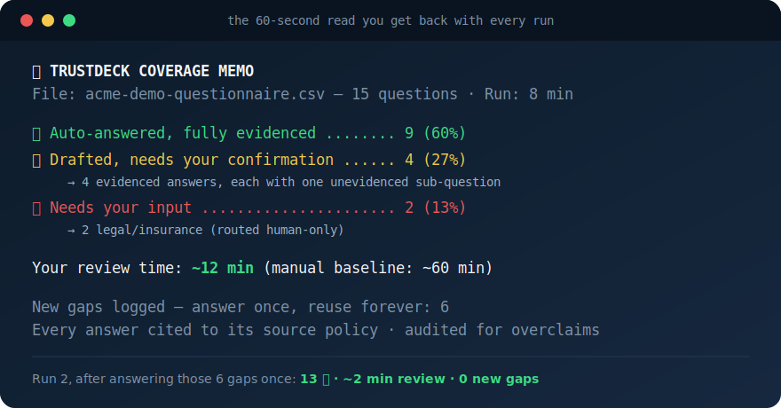

  

  
  
  
  

Enterprise deal on the line, and procurement just sent a 212-question
security questionnaire. That's 10–15 hours of your week — $1,000+ of anyone's
time — and it'll happen again next month.

**TrustDeck** is a five-agent team that answers vendor security
questionnaires — CAIQ, SIG, and custom Excel monsters — from **your actual
documentation**, and refuses to answer anything it can't prove. Every answer
carries an inline citation to the policy it came from, and a hostile
Auditor agent red-teams every draft for overclaims before you ever see it.

## Results

  

| Run | Questions | 🟢 evidenced | 🟡 confirm | 🔴 routed to you | Your review time |
|---|---|---|---|---|---|
| [Demo, run 1](demo/acme-coverage-memo.md) (cold corpus) | 15 | 9 (60%) | 4 | 2 | ~12 min |
| [Demo, run 2](demo/acme-coverage-memo-run2.md) (6 gaps answered once) | 15 | 13 (87%) | 2 | 0 | ~2 min |
| [CAIQ-Lite, cold](benchmark/caiq-lite-benchmark-memo.md) (12-doc corpus) | 124 | 56 (45%) | 0 | 68 | ~272 min |
| [CAIQ-Lite, onboarded](benchmark/caiq-lite-benchmark-onboarded-memo.md) (after 45-min interview) | 124 | 118 (95%) | 4 | 2 | ~12 min |
| [CAIQ-Lite, Relay onboarded](benchmark/caiq-lite-benchmark-relay-memo.md) (second corpus) | 124 | 116 (94%) | 5 | 3 | ~17 min |
| [Relay demo](relay-coverage-memo.md) (run live by the deployed product) | 15 | 9 (60%) | 4 | 2 | ~12 min |

Zero fabrications in every run — including honest, documented "no" answers
(no bug bounty, no SBOMs, no CMK). An evidenced "no" is a 🟢, because
auditors trust vendors who know what they don't have.

The Relay run is special: it was produced end-to-end by the deployed
product — a live onboarding interview followed by the full pipeline,
including two overclaims the Auditor caught and removed:

  

Every tool in this category publishes an accuracy number, and every one of
them is self-graded. These verdicts are artifacts in the repo
([relay-auditor-verdict.json](relay-auditor-verdict.json)) — you don't take
the claim on faith, you re-run the numbers.

All benchmark data is fictional demo data (Acme and Relay), watermarked
and reproducible from the files in this repo — and
[checked in CI](.github/workflows/consistency.yml): every memo, register, and
library must reconcile, or the build fails. We audit our own numbers the way
the Auditor audits answers.

## How it works

| Agent | Mission |
|---|---|
| 🔍 [Lead](agents/lead.md) | Parses any format; routes legal & insurance questions to you, never the AI |
| 📚 [Librarian](agents/librarian.md) | Retrieves evidence from your docs; grades it STRONG / PARTIAL / NONE |
| ✍️ [Drafter](agents/drafter.md) | Writes reviewer-ready answers with inline citations |
| 🕵️ [Auditor](agents/auditor.md) | Red-teams every answer for overclaims — zero fabrications enforced here |
| 📦 [Assembler](agents/assembler.md) | Returns your original file filled in, plus the Coverage Memo and Gap Register |

Every answer is confidence-tagged: **🟢 evidenced** → send it ·
**🟡 partial** → 1-minute confirm · **🔴 no basis** → routed to you, never
guessed.

## Try the demo (10 minutes, no setup)

  

The repo ships a complete worked example against a fictional company:

1. **Read the input:** [demo/acme-demo-questionnaire.csv](demo/acme-demo-questionnaire.csv)
   (or the [.xlsx version](demo/acme-demo-questionnaire.xlsx)) — 15 questions,
   the kind procurement actually sends.
2. **Read the corpus it answers from:** [demo/acme-sample-corpus.md](demo/acme-sample-corpus.md)
   — note the four facts it deliberately *doesn't* contain.
3. **See the output:** [demo/acme-demo-completed.csv](demo/acme-demo-completed.csv)
   / [.xlsx](demo/acme-demo-completed.xlsx) — cited answers, honest 🟡 flags on
   the four missing facts, legal questions routed, nothing invented.
4. **Check the receipts:** [demo/acme-auditor-verdict.json](demo/acme-auditor-verdict.json)
   shows the Auditor's per-question verdicts, including four answers it
   downgraded from 🟢 to 🟡.
5. **Watch the flywheel:** the owner answers the six gaps once
   ([demo/acme-gap-answers.md](demo/acme-gap-answers.md)), and
   [run 2](demo/acme-demo-completed-run2.csv) hits 13/15 🟢 with a ~2-minute
   review.

To run TrustDeck on your own questionnaires: install it from the marketplace
listing, try demo mode, then let the Librarian run the
[20-minute onboarding interview](trustdeck-onboarding-interview.md) to build
your real Trust Corpus. Tier 1 handles short questionnaires the same day;
Tier 1+2 (~45 min total) covers all 17 CCM v4 domains — full CAIQ class.

## What's in this repo

| Path | Contents |
|---|---|
| [agents/](agents/) | The five agents' public contracts and the pipeline's shared rules (full role specs ship with the product) |
| [demo/](demo/) | The complete worked example: corpus, questionnaire (csv+xlsx), answers, auditor verdicts, coverage memos, gap register, answer library |
| relay-*.md/.csv/.json | The second worked example — Relay Field Systems, produced live by the deployed product (interview results, corpus, verdicts, completed questionnaire, memo) |
| [benchmark/](benchmark/) | CAIQ-Lite (124 questions), the filled-in cold run, and the cold vs onboarded memos |
| [trustdeck-onboarding-interview.md](trustdeck-onboarding-interview.md) | Tier 1 of the onboarding interview, published in full (Tiers 2–3 and the CCM v4 / SOC 2 / ISO 27001 / NIST CSF coverage map ship with the product) |
| [marketplace-listing.md](marketplace-listing.md) | Listing copy and FAQ |
| [scripts/](scripts/) | `check_consistency.py` — the CI-enforced cross-artifact number checks |
| [SECURITY.md](SECURITY.md) | Data handling: what to upload, what never to, and how demo data is isolated |

## Early adopters

TrustDeck is at launch pricing, published as a ladder that executes exactly
as written: the first 25 buyers pay $29, buyers 26–100 pay $58, and the
final price is $79. Early users get the low price in exchange for being
early. Two ways they shape the product:

- **[📊 Share your results](../../issues/new?template=share-results.md)** —
  post your Coverage Memo numbers from a real run (stats only, nothing
  confidential). Real-world results are the one proof this repo's demo can't
  generate, and the best ones go in the listing.
- **[🚨 Report a fabrication](../../issues/new?template=report-fabrication.md)** —
  if TrustDeck ever claims something your evidence doesn't support, that
  report is a release blocker. Holding us to the zero-fabrication promise is
  the whole point.

## Ground rules

- **TrustDeck drafts; you approve.** It will never fabricate a control you
  don't have — that's the point.
- All Acme data is fictional and watermarked "DEMO — Acme sample data." It is
  never cited on a real run.
- Legal and insurance questions are always routed to a human.
- Contributions: see [CONTRIBUTING.md](CONTRIBUTING.md) and
  [WORKFLOW.md](WORKFLOW.md). License: [scoped](LICENSE) — the demo data,
  benchmarks, and tooling are MIT so you can audit and reproduce everything;
  the product content (agent contracts, interview) is source-visible but all
  rights reserved.

---

<i>Built by a cloud security architect with 15+ years in federal and enterprise environments — it answers the way auditors expect, because it was designed by someone who's sat on both sides of the table.</i>

