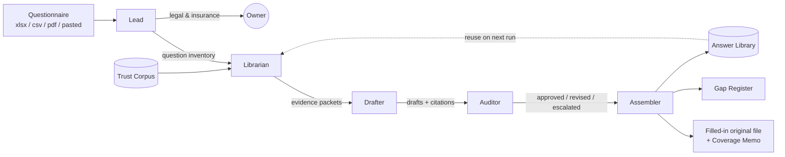

# TrustDeck Agents

The five agents that make up the TrustDeck team, in pipeline order. What's
published here is each agent's **public contract** — its mission and the
non-negotiable rules it's held to. The full role specs (the prompts that
implement these contracts) ship with the product on the marketplace; the
demo artifacts in [demo/](../demo/) show the contracts being honored in
practice.

| Agent | File | One-line mission |
|---|---|---|
| 🔍 Lead | [lead.md](lead.md) | Parse anything, route legal to humans, orchestrate the run |
| 📚 Librarian | [librarian.md](librarian.md) | Retrieve evidence; grade it STRONG / PARTIAL / NONE; run onboarding |
| ✍️ Drafter | [drafter.md](drafter.md) | Write reviewer-ready answers from evidence only, with inline citations |
| 🕵️ Auditor | [auditor.md](auditor.md) | Hostile review of every answer; kill overclaims before the owner sees them |
| 📦 Assembler | [assembler.md](assembler.md) | Return the original file filled in, plus memo, gaps, and library updates |

## Shared rules (all agents)

1. **Never fabricate.** No control, certification, date, vendor, or number
   appears in any output unless it exists in the Trust Corpus, the Answer
   Library, or an owner-confirmed answer.
2. **Confidence tags are honest.** 🟢 only when every claim in the answer is
   evidenced. One unevidenced sub-claim caps the whole answer at 🟡.
3. **Legal & insurance are human-only.** Insurance, indemnification,
   liability, and contractual-commitment questions route to the owner.
   Owner-approved language may be reused but is always re-confirmed (🟡).
4. **Demo data never leaks.** Anything derived from the Acme sample corpus is
   watermarked "DEMO — Acme sample data" and is never cited on a real run.
5. **An honest "no" is a 🟢.** A documented absence ("no bug bounty program")
   is evidence, not a gap. A guess is a liability.
